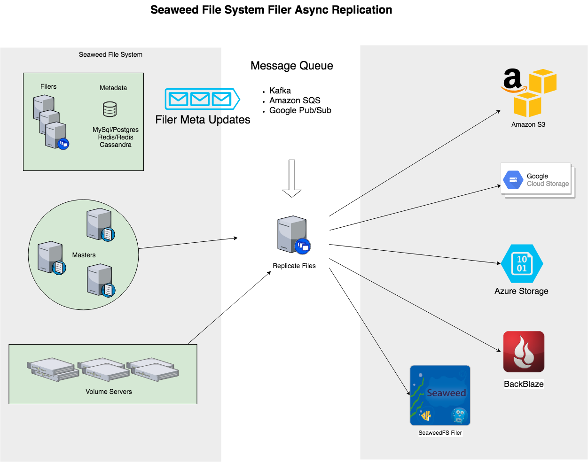

Cloud storage options, such as Amazon S3, Google Cloud Storage, Azure, Backblaze B2, etc, are ideal for backup purpose.

For example, for Amazon S3, the upload is free. You only pay for the storage.
So you have the benefit of:
* Extremely fast access to local SeaweedFS Filer
* Near-Real-Time Backup to Amazon S3 with zero-cost upload network traffic.

# Architecture (Deprecated by [[Async-Backup]])

Every file changes in Filer will trigger a notification sent to a message queue.
A "weed replicate" process will read from the message queue, read the actual file content, and send the update to the cloud sink.

* Message Queue can be: Kafka, AWS SQS, Google Cloud Platform Pub/Sub.
* Cloud Sink can be: AWS S3, Google Cloud Storage, Microsoft Azure, Backblaze B2.



# Configuration
* Configure notification. use "`weed scaffold -config=notification`" to see the notification section.

```
[notification.kafka]
enabled = true
hosts = [
  "localhost:9092"
]
topic = "seaweedfs_filer_to_s3"

```

* Setup Kafka. Possibly you need to create the Kafka topic if auto topic creation is not enabled.

* Configure replication. use "`weed scaffold -config=replication`" to see the notification section.

```
[source.filer]
enabled = true
grpcAddress = "localhost:18888"
directory = "/buckets"    # all files under this directory tree are replicated

[sink.s3]
# read credentials doc at https://docs.aws.amazon.com/sdk-for-go/v1/developer-guide/sessions.html
# default loads credentials from the shared credentials file (~/.aws/credentials).
enabled = false
aws_access_key_id     = ""     # if empty, loads from the shared credentials file (~/.aws/credentials).
aws_secret_access_key = ""     # if empty, loads from the shared credentials file (~/.aws/credentials).
region = "us-west-1"
bucket = "your_bucket_name"    # an existing bucket
directory = "/"                 # destination directory

```

* Start the Kafka.
* Start the replication. "`weed filer.replicate`"
* Start the filer. "`weed filer`"

# Replicate existing files
See [[Async-Replication-to-another-Filer#replicate-existing-files]]