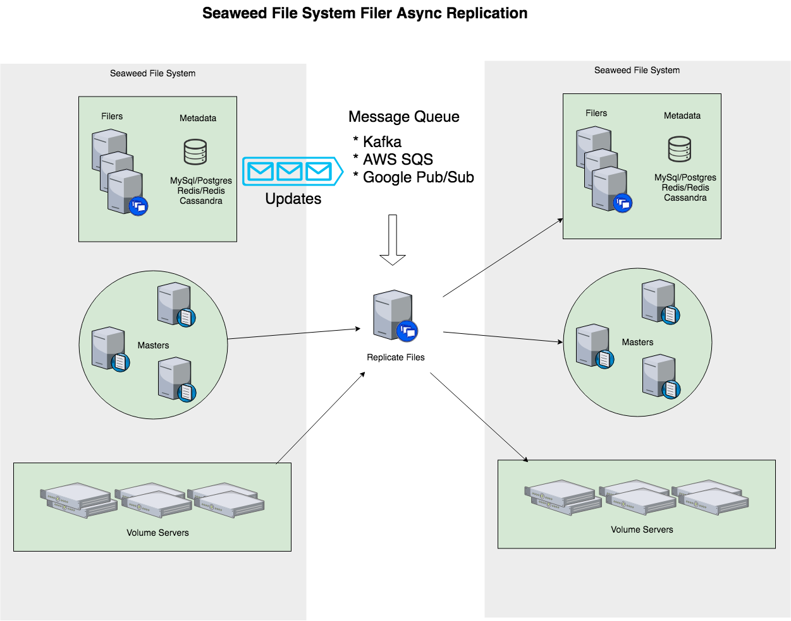

# Deprecated 

This feature is replace by https://github.com/seaweedfs/seaweedfs/wiki/Filer-Active-Active-cross-cluster-continuous-synchronization

# Architecture



# Requirements

There should be two Seaweed File Systems running, possibly across data centers. Each should have its filer, master, and volume servers.

# Configuration
* Configure notification. use "`weed scaffold -config=notification`" to see the notification section.

```
[notification.log]
# this is only for debugging perpose and does not work with "weed filer.replicate"
enabled = false


[notification.kafka]
enabled = false
hosts = [
  "localhost:9092"
]
topic = "seaweedfs_filer"
offsetFile = "./last.offset"
offsetSaveIntervalSeconds = 10


[notification.aws_sqs]
# experimental, let me know if it works
enabled = false
aws_access_key_id     = ""        # if empty, loads from the shared credentials file (~/.aws/credentials).
aws_secret_access_key = ""        # if empty, loads from the shared credentials file (~/.aws/credentials).
region = "us-east-2"
sqs_queue_name = "my_filer_queue" # an existing queue name


[notification.google_pub_sub]
# read credentials doc at https://cloud.google.com/docs/authentication/getting-started
enabled = false
google_application_credentials = "/path/to/x.json" # path to json credential file
project_id = ""                       # an existing project id
topic = "seaweedfs_filer_topic"       # a topic, auto created if does not exists

[notification.gocdk_pub_sub]
# The Go Cloud Development Kit (https://gocloud.dev).
# PubSub API (https://godoc.org/gocloud.dev/pubsub).
# Supports AWS SNS/SQS, Azure Service Bus, Google PubSub, NATS and RabbitMQ.
enabled = false
# This URL will Dial the RabbitMQ server at the URL in the environment
# variable RABBIT_SERVER_URL and open the exchange "myexchange".
# The exchange must have already been created by some other means, like
# the RabbitMQ management plugin.
topic_url = "rabbit://myexchange"
sub_url = "rabbit://myqueue"

```

* Setup Kafka. Possibly you need to create the Kafka topic if auto topic creation is not enabled.

* Configure replication. use "`weed scaffold -config=replication`" to see the source and sink sections.

```
[source.filer]
enabled = true
grpcAddress = "localhost:18888"
directory = "/buckets"    # all files under this directory tree are replicated

[notification.kafka]
enabled = true
hosts = [
  "localhost:9092"
]
topic = "seaweedfs_filer1_to_filer2"

[sink.filer]
enabled = true
grpcAddress = "localhost:18888"
directory = "/backup"    # all replicated files are under this directory tree
replication = ""
collection = ""
ttlSec = 0

```

Please read the source.filer and sink.filer configurations carefully and make sure you fully understand its intention. This is actually using one filer and replicate files from one folder to another folder.

* Start the Kafka.
* Start the replication. "`weed filer.replicate`"
* Start the filer. "`weed filer`"

# Replicate existing files

The `weed filer.replicate` only replicates files that have been updated. If there are already a lot of files, very likely you would need to copy them too.

To do this, use `echo 'fs.meta.notify' | weed shell`, which will iterate all files and generate one "file creation" event for each file to the message queue. Thus, all files will be replicated.
