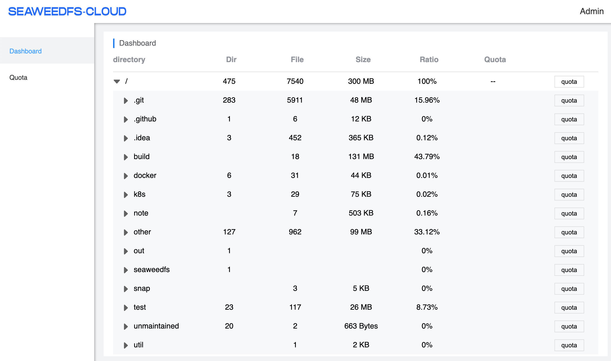

Seaweed Cloud Monitoring is a service provided by seaweedfs.com. It is an attempt to help SeaweedFS to grow organically, 
* Iterate faster without upgrading the whole cluster.
* Help SeaweedFS admin to manage the clusters via internet.

# Architecture

```
  Browser => Seaweed Cloud <==> Seaweed Agent <==> SeaweedFS cluster
```
The Seaweed Agent is a simple docker image `chrislusf/seaweed_agent`. Just need to run the docker image, setting the filer address and a password. To upgrade, just pull the latest image and restart.

The docker image should be able to run for recent SeaweedFS clusters since 2.58 or so. There are no specific requirement for the SeaweedFS cluster.

It subscribes to metadata changes from a SeaweedFS cluster, and build up statistics. When it starts, it may take some time to process existing metadata logs, if there are a lot of files or a lot of updates.

When accessing the monitoring URL, the Seaweed Cloud would proxy the requests to the agent, get the statistics, and render to the web page. There are no data persisted on the Seaweed Cloud. (It is running on a free-tier web server.)

## Features
Currently it has very basic features and all in beta. 

Existing features:
* Near real time directory statistics on disk usage, file count and directory count.
* Set quota for any directory.
* Automatically delete empty folders in buckets (under `/buckets`), to be more compatible with AWS S3 object store.



# Start Seaweed Agent

To try it out, run these with docker. It should print out a URL which you can visit.

```
docker run --pull always -ti chrislusf/seaweed_agent swagent -filer 192.168.2.11:8888 -password=your_password

# or set the password via environment variables

docker run --pull always -e SEAWEED_PASSWORD=your_password -ti chrislusf/seaweed_agent swagent -filer 192.168.2.11:8888

```

The Seaweed Agent is still constantly evolving. So better always use the latest version.

# Get Cloud Monitoring URL

The container instance should have similar output, which you can find the Cloud Monitoring URL:
```
docker run --pull always -e SEAWEED_PASSWORD=abc -ti chrislusf/seaweed_agent swagent -filer 192.168.2.10:8888
2021/09/14 05:35:41 connecting to grpc.seaweedfs.com:4772
2021/09/14 05:35:41 read /etc/seaweedfs/filer.conf: ReadEntry: filer: no entry is found in filer store
2021/09/14 05:35:41 tracking 192.168.2.10:8888: 1970-01-01 00:00:00 +0000 UTC
2021/09/14 05:35:42 connected to grpc.seaweedfs.com:4772

---
Free Monitoring Data URL:
https://cloud.seaweedfs.com/ui/593HZ8CV9VF5976A8S0UABCDEFGHIJKL
---
Filer version: 30GB 2.67

```

## Find the URL through `weed shell`
Now when starting `weed shell`, it should also print out the Cloud Monitoring URL:
```
$ weed shell
master: localhost:9333 filer: localhost:8888
I0913 22:50:51 96301 masterclient.go:96] adminShell masterClient Connecting to master localhost:9333

---
Free Monitoring Data URL:
https://cloud.seaweedfs.com/ui/593HZ8CV9VF5976A8S0UABCDEFGHIJKL
---
>
```