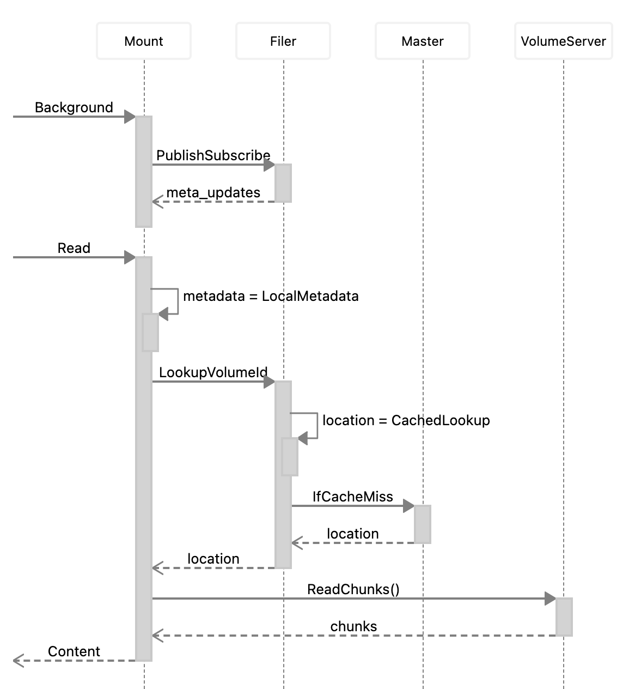
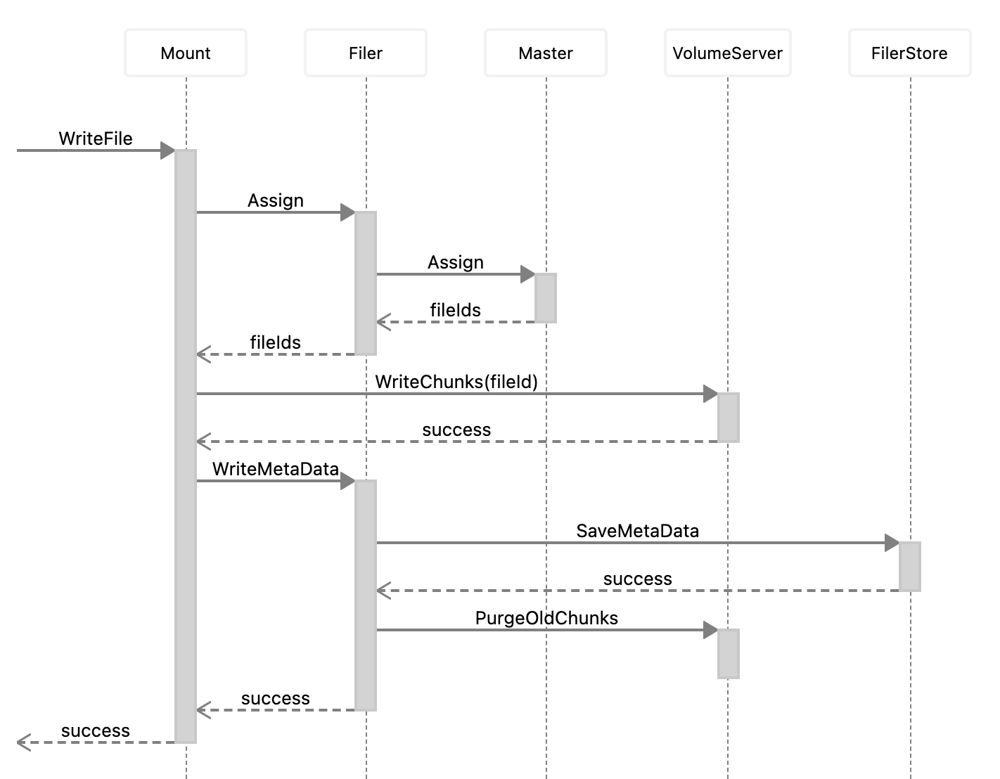

### Supported Features
With "weed mount", the files can be operated as a local file. The following operations are supported.
* file read / write
* create new file
* mkdir
* list
* remove
* rename
* chmod
* chown
* soft link
* hard link
* display free disk space
* copy file range
* lseek

### Mount as FUSE

This uses seaweedfs/fuse, which enables writing FUSE file systems on Linux and OS X. On OS X, it requires OSXFUSE (https://osxfuse.github.io/).

```bash
# assuming you already started weed master, weed volume and filer
weed mount -filer=localhost:8888 -dir=/some/existing/dir -filer.path=/one/remote/folder
weed mount -filer=localhost:8888 -dir=/some/existing/dir -filer.path=/
# example: mount one collection and a folder to a local directory
weed mount -filer=localhost:8888 -dir=~/folder_on_seaweedfs -filer.path=/home/chris -collection=chris
```

It is also possible use mount and fuse subtype:

```bash
cp weed /sbin/weed
mount -t fuse.weed fuse /mnt -o "filer=localhost:8888,filer.path=/"
```

Or add weed as a mount subtype:

```bash
cp weed /sbin/mount.weed
mount -t weed fuse /mnt -o "filer=localhost:8888,filer.path=/"
```

To mount with multiple filers enclose filer parameter with quotes and separate servers with comma:

```bash
cp weed /sbin/mount.weed
mount -t weed fuse /mnt -o "filer='192.168.0.1:8888,192.168.0.2:8888',filer.path=/"
```

Now you can operate the SeaweedFS files, browsing or modifying directories and files, in local file system. 
To unmount, just shut it down the "weed mount".

#### Mount outside of a SeaweedFS cluster

In addition to connecting to filer server, `weed mount` also directly connects to volume servers directly for better performance. 
However, if the SeaweedFS cluster is started by Kubernetes or docker-compose and 
the volume servers only knows its own IP addresses inside the cluster, 
`weed mount` is not able to access the volume servers from outside of the cluster.

`weed mount -volumeServerAccess=[direct|publicUrl|filerProxy]` option can help here. You can choose to proxy the requests to volume servers via filer.
So only filer needs to be exposed. Or you can choose to expose the public URLs of volume servers.

#### Multiple mounts with multiple Filers of a SeaweedFS cluster

Updates from one filer are transferred to the other filers. The filers would not be constantly querying the 
filer stores for updates. Instead, the filers will listen to each other for updates, which is more efficient.

So for the following topology, the updates from one mount can be propagated to other mounts. 

```

mount1 ---> filer1 ---> filer2 ---> mount2
                |
                +-----> filer3 ---> mount3
```

However, in most cases, one filer should be enough, since the mount will only get asynchronous metadata updates to filer,
and will read and write to the volume servers directly, one filer should be enough to handle most of the work.

```

filer ---- mount1
   |
   +------ mount2
   |
   +------ mount3

```

#### Mount directory on host from docker-compose

If docker compose is being used to manage the server (eg. https://github.com/seaweedfs/seaweedfs/wiki/Getting-Started#with-compose) 
it's possible to mount a directory on the host with docker privileged mode like so:
```
  mount_1:
    # Mount my weed seaweed volume to host /weed path
    image: chrislusf/seaweedfs
    privileged: true
    pid: host
    entrypoint: 'nsenter -t 1 -m -u -n -i -- /usr/bin/weed mount -filer="localhost:8888,localhost:8889" -filer.path=/weed -dir=/weed'
    depends_on:
      - master
      - filer
```

### Weed Mount Architecture

`weed mount` has a persistent client connecting to Master, to get the location updates of all volumes.
There are no network round trip to lookup the volume id location.

`weed mount` also continuously synchronize all metadata updates with the Filer. So later reads would not need a network read from Filer, and the metadata reads, e.g., directory listings, are all local operations.

For reads:
1. Mount optionally lookups volume Id => Weed Filer => Weed Master
2. Mount Reads File Chunks => Weed Volume Servers



For writes:
1. Mount uploads data to Weed Volume Servers, and breaks the large files into chunks.
2. Mount writes the metadata and chunk information into Filer and then into Filer database.



### Weed Mount Performance

Compared to any other distributed file systems, the `weed mount` performance should exceed most other solutions, or at least on par. This is because `weed mount` has multiple optimization techniques:
* asynchronously replicate the metadata updates to local db. There are no remote metadata read operations at all.
* cached most recently accessed data. 
* batch small writes into large writes.

Due to the limitation of FUSE and network IO, the performance of the mounted file system is expected to be less than local disk. `weed mount` still needs to write to remote filer server and volume servers to ensure data persistence.

So if your data is temporary local files, try to move the writes to other unmounted directories. If the data is shared across the distributed file system, the additional cost to write should be acceptable for most cases.

For example, you can create a soft link to a directory or a file on a local disk, and put temp data there.

#### Sysbench Benchmark Results

"sysbench" is used here. The mount command line is `weed mount -dir=xx`

If you have better benchmarking tools, please share your results.

```
$ brew install sysbench
$ cd /a/mounted/folder
$ sysbench --test=fileio --file-total-size=1G prepare

$ sysbench --test=fileio --file-total-size=1G --file-test-mode=rndrw --max-time=60 --max-requests=0 --num-threads=1 --file-block-size=1m run
WARNING: the --test option is deprecated. You can pass a script name or path on the command line without any options.
WARNING: --max-time is deprecated, use --time instead
sysbench 1.0.20 (using system LuaJIT 2.1.0-beta3)

Running the test with following options:
Number of threads: 1
Initializing random number generator from current time


Extra file open flags: (none)
128 files, 8MiB each
1GiB total file size
Block size 1MiB
Number of IO requests: 0
Read/Write ratio for combined random IO test: 1.50
Periodic FSYNC enabled, calling fsync() each 100 requests.
Calling fsync() at the end of test, Enabled.
Using synchronous I/O mode
Doing random r/w test
Initializing worker threads...

Threads started!


File operations:
    reads/s:                      958.24
    writes/s:                     638.84
    fsyncs/s:                     2045.67

Throughput:
    read, MiB/s:                  958.24
    written, MiB/s:               638.84

General statistics:
    total time:                          60.0045s
    total number of events:              218458

Latency (ms):
         min:                                    0.02
         avg:                                    0.27
         max:                                  166.61
         95th percentile:                        1.01
         sum:                                59775.56

Threads fairness:
    events (avg/stddev):           218458.0000/0.00
    execution time (avg/stddev):   59.7756/0.00

```
The above is single-threaded. The following uses 16 threads.
```
$ sysbench --test=fileio --file-total-size=1G --file-test-mode=rndrw --max-time=60 --max-requests=0 --num-threads=16 --file-block-size=1m run
WARNING: the --test option is deprecated. You can pass a script name or path on the command line without any options.
WARNING: --num-threads is deprecated, use --threads instead
WARNING: --max-time is deprecated, use --time instead
sysbench 1.0.20 (using system LuaJIT 2.1.0-beta3)

Running the test with following options:
Number of threads: 16
Initializing random number generator from current time


Extra file open flags: (none)
128 files, 8MiB each
1GiB total file size
Block size 1MiB
Number of IO requests: 0
Read/Write ratio for combined random IO test: 1.50
Periodic FSYNC enabled, calling fsync() each 100 requests.
Calling fsync() at the end of test, Enabled.
Using synchronous I/O mode
Doing random r/w test
Initializing worker threads...

Threads started!


File operations:
    reads/s:                      2152.89
    writes/s:                     1435.49
    fsyncs/s:                     4625.57

Throughput:
    read, MiB/s:                  2152.89
    written, MiB/s:               1435.49

General statistics:
    total time:                          60.0198s
    total number of events:              490963

Latency (ms):
         min:                                    0.03
         avg:                                    1.95
         max:                                  215.50
         95th percentile:                        9.22
         sum:                               958761.77

Threads fairness:
    events (avg/stddev):           30685.1875/161.07
    execution time (avg/stddev):   59.9226/0.00

```

##### Sysbench Result Analysis
sysbench works on 128 files, 8MiB each. It will do random read and write on these files.

`weed mount` has default `cacheCapacityMB=1000`, but because the cache has different section for different sized chunks, the actual cache used for this workload is about 500MB. However, due to the randomness, the actual hit rate is not high.

Even with the cache, the data are persisted on the filer and volume servers first, then cached locally. 

## Common Problems ##

### Unmount ###

Sometimes `weed mount` can not start if the last mount process was not cleaned up.

You can clean up with these commands. Try any of them until it works:

```
// on mac
sudo umount /the/mounted/dir
diskutil unmount force /the/mounted/dir
sudo umount -f /the/mounted/dir
sudo umount -l /the/mounted/dir

// on linux
sudo umount -f /the/mounted/dir
sudo umount -l /the/mounted/dir

```
### Still fail to mount on MacOS ###
From https://github.com/osxfuse/osxfuse/issues/358
> FUSE needs to register a virtual device for exchanging messages between the kernel and the actual file system implementation running in user space. The number of available device slots is limited by macOS. So if you are using other software like VMware, VirtualBox, TunTap, Intel HAXM, ..., that eat up all free device slots, FUSE will not be able to register its virtual device.

### Samba share mounted folder  ###
From https://github.com/seaweedfs/seaweedfs/issues/936
The issue is with samba.conf. If you see NT_STATUS_ACCESS_DENIED error, try to add `force user` and `force group` to your samba.conf file.
```
[profiles]
   comment = Users profiles
   path = /home/chris/mm
   guest ok = yes
   browseable = yes
   create mask = 0775
   directory mask = 0775
   force user = root
   force group = root
```
