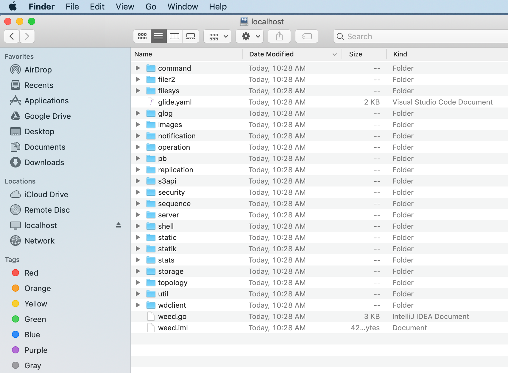

SeaweedFS provides `weed webdav` command to enable accessing via WebDAV. 

Current implementation does not enforce authentication yet.

There are many existing WebDAV options. You can always choose to `weed mount` the Filer first, and use your own WebDAV option.

# Access SeaweedFS via WebDAV on Mac
1. Open "Finder" > "Go" > "Connect to Server"

1. Enter the URL of the filer, Format: `http://<filerHost>:<filerPort>`

1. Connect as "Guest"

1. Connected! Now you can operate the files as normal files.

