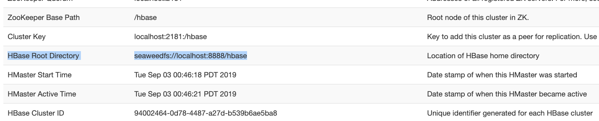

# Installation for HBase

Two steps to run HBase on SeaweedFS
1. Copy the seaweedfs-hadoop2-client-3.13.jar to `${HBASE_HOME}/lib`
1. And add the following 2 properties in `${HBASE_HOME}/conf/hbase-site.xml`

```
<configuration>
  <property>
    <name>hbase.cluster.distributed</name>
    <value>true</value>
  </property>
  <property>
    <name>hbase.rootdir</name>
    <value>seaweedfs://localhost:8888/hbase</value>
  </property>
  <property>
    <name>fs.seaweedfs.impl</name>
    <value>seaweed.hdfs.SeaweedFileSystem</value>
  </property>
  <property>
    <name>hbase.unsafe.stream.capability.enforce</name>
    <value>false</value>
  </property>
</configuration>
```

Visit HBase Web UI at `http://<hostname>:16010` to confirm that HBase is running on SeaweedFS


